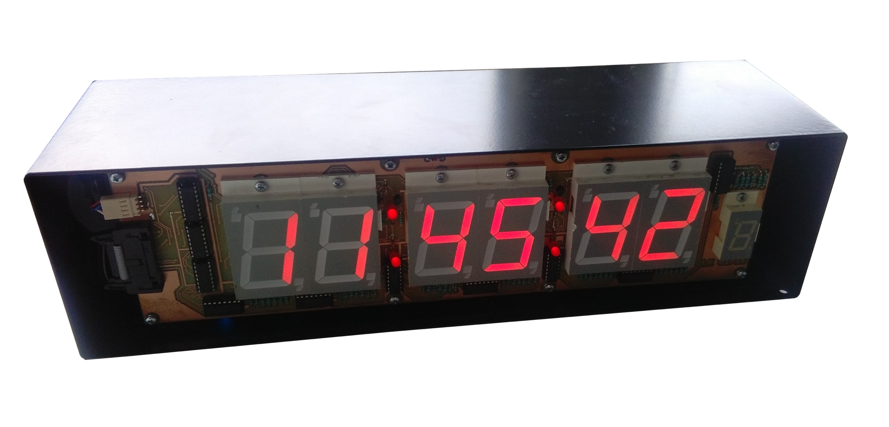

# Digital Clock

The digital clock hardware and software is a result of a Final-Year Project at <b>SŠIEŘ Rožnov pod Radhoštěm </b> (Czech Republic) as part of <b>Maturita Exam</b> (A-levels equivalent). All hardware, circuit boards schematics and software written in assembly language are available through an open-source licence.

## About the Project
<b>Hardware</b> 
A custom architecture based on Intel Microcontroler <b>i8051/MCS-51</b> *(8-bit, 128B RAM, 4x 8-bit paraler ports, 24MHz)*. Seven-segment displays are controlled by additional drivers and their intensity is adjustable by a potentiometer on the back panel. Chassis was custom made by SSI Schäfer, s.r.o.  
All Cirucit Boards are single-side printed:  
LK01-16 - The seven-segment dispalys.  
LK02-16 - The main board embeding microcontroller i8051 and Epson real-time chip <b>RTC72421</b> 
LK03-16 - The board contains switches for time setting and a potentiometer for adjusting brigthness of the dispaly.

<b>Software</b>
Software is developed in an assembly language for Intel microcontrolers series i8051/MSC-51. 
Insturction set and manuals are available at: <a href='http://web.mit.edu/6.115/www/document/8051.pdf'> http://web.mit.edu/6.115/www/document/8051.pdf </a>
